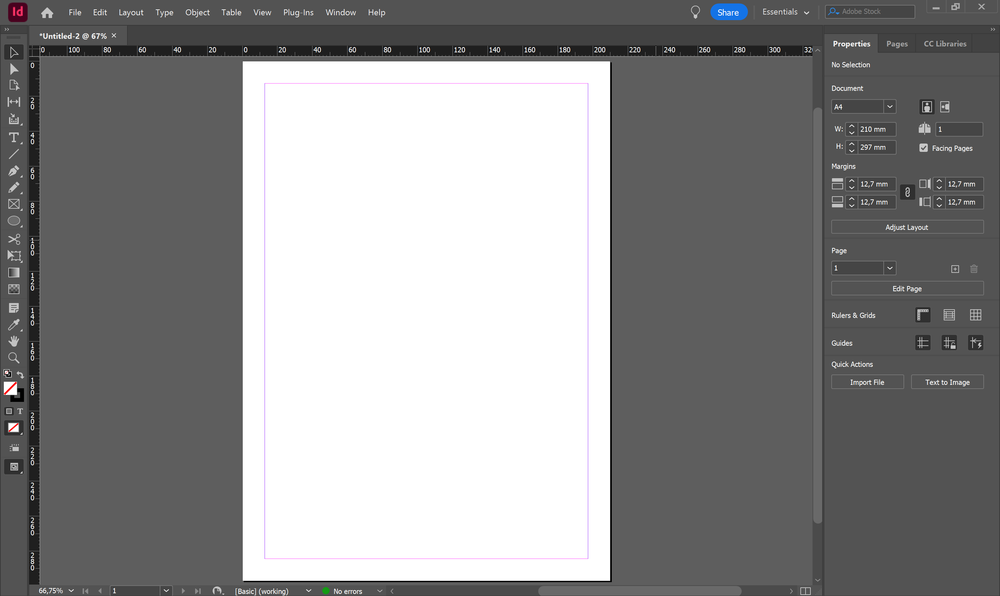
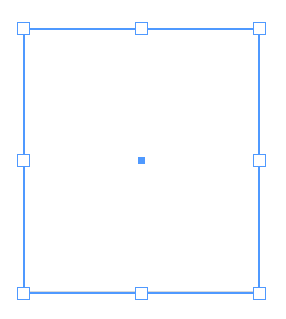
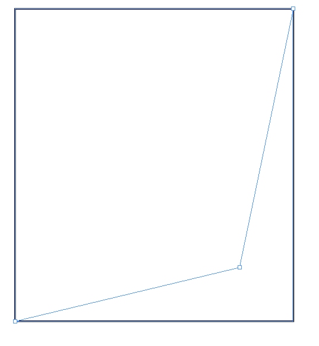

# InDesign alapok

> Ez is csak egy Adobe slop...

## Projektek

Ez fogad minket elsőre, itt tudunk új dokumentumot létrehozni. 

Részletesebb beállíátokat a `More Presets` alatt találunk. Nekünk egyelőre elég az alap A4-es.

## A felület

Ha először nyitjuk meg az InDesignt, akkor ez a munkaterület fogad minket. Mielőtt elmondanék bármit is róla, állítsuk át egy kicsit részletesebbre.
A fejlécen az Essentials feliratra kattintva válasszuk ki az Advanced nézetet.

!!! note "A workspacekről"
    A többi Adobe programhoz hasonlóan itt is vannak előre definiált munkaterületek, és itt is hasonló módon személyre tudjuk szabni az elrendezést és az előbeállításokat. Ha elrontanánk valamit, akkor ugyan ebben a legördülő menüben tudjuk visszaállítani az alapértelmezésre. A workspacek panelekből (avagy tab groupokból) és tabokból állnak, ezek elrendezését és viselkedését egyesével tudjuk állítani. Javaslom, hogy játszadozz el vele egy kicsit (ha már van egy megszokott elrendezésed, akkor esetleg mentsd el előtte xd), a későbiekben nagyon hasznos lesz. 

Az Advanced nézet sem tökéletes, hiányzik pár alapvető dolok, ezeket a `Window` menüből tudjuk elővenni. 
Ezek elsőre lehet, hogy lebegő ablakokban jelennek meg, ha szeretnénk, a legtöbb dolgok hozzá tudjuk adni (csak odahúzod) a paneljeinkhez, hogy legközelebb kéznél legyenek.

> Az útmutató során esélyes, hogy olyan paneleket fogok használni, amik nem/másképp szerepelnek alapból. Ne ijedj meg, minden elérhető a `Window` menüben, és nem baj ha más az elrendezésed, ez ízlés kérdése.

### Nagy vonalakban

Legfelül a menük, alatta az eszköz specifikus vezérlő panel, bal oldalt az eszközök, középen a dokumentum, jobb oldalt különféle panelek találhatók.

## Alap billentyűkombinációk

Az Adobe programok egyik legnagyobb átka, hogy eltér minden eddig megszokott program legalapvetőbb gyorsbillentyűitől.

- ++space+right-button++: ha nyomva tartod tudod vele mozgazni a dokumentumot
- ++alt++ + görgő: nagyítás és kicsinyítés
- görgő: függőleges tekerés
- ++ctrl++ + görgő: vízszintes tekerés
- ++ctrl+z++: visszavonás
- ++ctrl+shift+z++: újra

Nem kell minden gyorsbillentyűt tudni kívülről, később a nagy részét amúgy is meg fogod tanulni, de fel fogom majd tűntetni őket, és ha valamilyen eszköz főlé viszed az egeredet is mutatja. Ha nagyon akarod, az `Edit > Keyboard Shortcuts` menüben lehet állítani.

# Alap koncepciók

## Objektumok

A legtöbb dolgot objektumnak tekinthetjük, legyen az szövegdoboz, képkeret, vonal vagy egyéb forma.

Szúrjunk be egy téglalapot a `Rectangle Tool`-lal (++m++).

{height=360}

Az objektumainkat a `Selection Tool`-lal (++v++) tudjuk kijelölni, mozgatni, átméretezni, forgatni stb.
Kijelöléshez kattintsunk az objektumra, húzással vagy a ++ctrl++ nyomvatartásával kijelölhetünk akár többet is.
(Mivel üres a téglalapunk belseje, ezért ezt a kereténél vagy a középső bigyusznál fogva tudjuk mozgatni.)

!!! tip "Kijelölés"
    Átlapolódás esetén a legfelső réteg elemeit fogja kiválasztani, de ha ++ctrl++-t nyomvatartva kattintunk, akkor a mögötte lévő elemet fogja kiválasztani, ha még egyszerűen kattintunk, akkor az azalatt lévőt, és így tovább.

A `Direct Selection Tool`-lal (++a++) tudjuk az objektumunk belső pontjait mozgazni. 
Például a téglalapunk esetén kiválaszthatunk pontokat és szabadon mozgathatjuk őket.

{height=360}
{height=360}

!!! tip "A módosítóbillenytűk általánosságban"
    A módosítóbillentyűk a legtöbb objektumnál ugyan úgy viselkednek.

    - ++shift++: méretezésnél tartja az arányokat, mozgatásnál csak vízszintesen, függőlegesen és átlósan enged mozgatni, forgatásnál 45 fokos lépésekben forgat
    - ++alt++: méretezésnél a középpontból méretez, ha nyomva tartjuk és úgy mozgatunk valamit, akkor lemásolja az objektumot
    - ++ctrl++: nyomvatartva több elemet is kijelölhetünk vele egyszerre

## Rétegek és keretek

Ahogyan a legtöbb kreatív program, az InDesign is rétegeket használ. 

{height=360}

A rétegeink tartalmaznak minden elemet, amit létrehozunk (szöveg, kép stb.).
Segítségükkel tudjuk rendszerezni a dokumentumunkat, és könnyen kezelhetjük az egymásra lógó elemeket: 
felsőbb réteg elemei a dokumentumon is felül lesznek, és kitakarják, ami alattuk van.

Új réteget a `+` gombbal tudunk hozzáadni, dupla kattintással át tudjuk nevezni.
A színes négyzetekre kattintva tudunk egész rétegeket, vagy elemeket kijelölni. 
Ha egyszerre több elemet szeretnénk, azt a ++shift++-tel tudjuk megtenni.
Fontos, hogy csak azokat az elemeket fogjuk látni a rétegeken, amik a kijelölt oldalon/oldalpáron vannak.
(Oldalpárt kijelölni dupla kattintással a `Pages` tabon, vagy csak simán a nézeten rákattintva lehet.)

### Csoportok

Rétegeken belül tovább csoportosíthatjuk az elemeket. Jelöljük ki csoportosítani kívánt elemeket, majd a `Object > Group` menüponttal (++ctrl+g++) egyesítsük őket egy csoportba.

## Oldalak és oldalpárok

Egy InDesign dokumentum oldalakból áll. 
Mi általában kötött/tűzött dokumentumokat készítünk, ezért többnyire oldalpárokban gondolkodunk, mint pl. egy nyitott könyvnél.
Az ezzel kapcsolatos dolgok a `Pages` tabon érhetők el.

{height=360}

A `+` ikonnal tudunk hozzáadni új oldalakat.
Láthatjuk, hogy 3 oldalunk és 2 oldalpárunk van.
A furcsa elrendezés azért van, mert az első oldalunk - a borító - külön áll.

<!-- 
TODO: facing pages, document setup stb.
TODO: parents
- section markers
TODO: master page, shift ctrl katt hogy lehessen editelni? 
-->

Minden oldalpárhoz tartozik körülötte lelógó hely (pasteboard).

Ami lelóg, vagy nincs rajta az oldalon, az nem fog megjelenni nyomtatásban, de a szerkesztéskor hasznos lehet, ha pl. még nem találod valaminek a helyét. Ha látni szeretnéd, hogy mi fog ténylegesen megjelenni, akkor ++w++-vel tudsz a normal és a preview nézetek között váltani (vagy van neki gomb az eszköztár alján). 

<!-- TODO: move this -->
!!! note "Kapcsolódó menük"
    -  `File > Document Setup`: dokumentum bállítások, méretek, margók, előlap 

<!-- TODO: bleed (kifutó), margins -->

