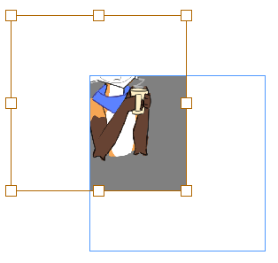
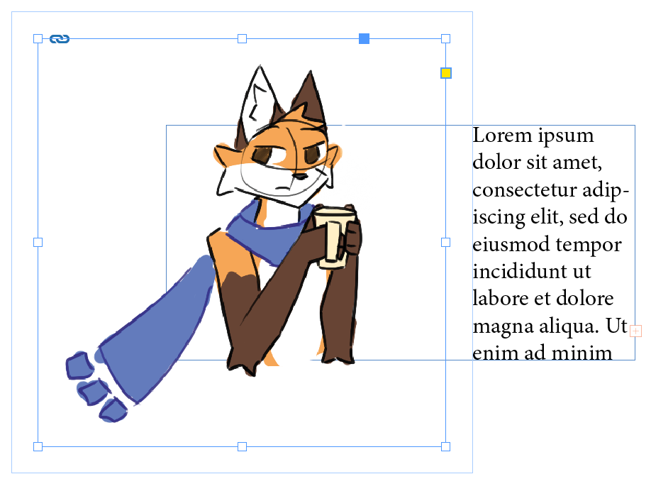
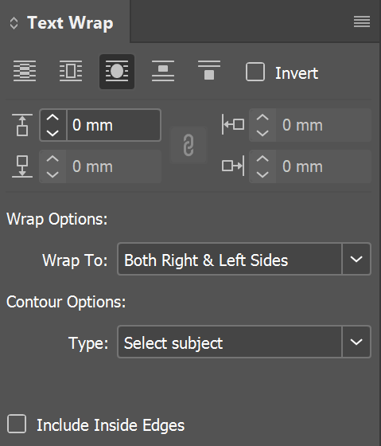
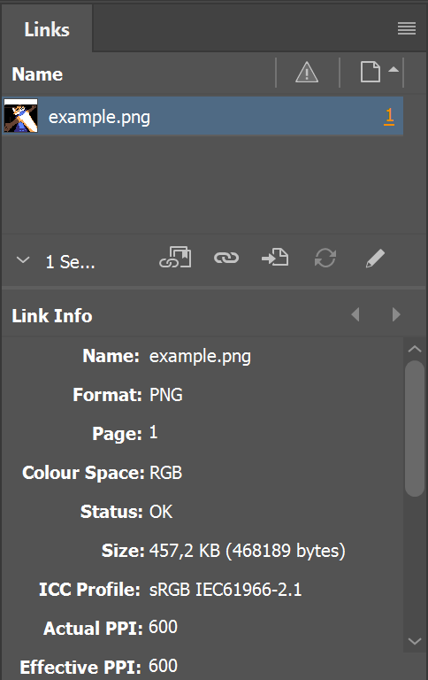

# Képek

Az InDesign külön kezeli a képeket és a képkereteket. 
A kép és a kerete külön mozgathatók.
A kép azon része, ami a kereten kívülre esik, nem fog látszani.

Képeket beszúrni drag&droppal vagy a `File > Place` ++ctrl+d++ menüből tudunk. 
Ha minden jól meg, ez fogad minket:

{height=360}

??? tip "A beszúrt képekről"
    Ha nagyobb képeket szúrunk be, akkor esélyes, hogy óriási méretűek lesznek, és emiatt nem látszódnak. Ilyenkor elég nagy macera tud lenni átméretezni őket, erre megoldás lehet kézzel beállítani a méretüket a felső sávban. Ügyeljünk a képarányra (lánc ikon)!

    

Az méretezés és a mozgatás irányítása a legkevésbé sem magától éretődő, és nekem is rengeteg fejfájás volt eleinte.

**Mozgatás:**

- A `Selection Tool`-lal (++v++) tudjuk mozgazni a képet és a keretet egyszerre.
    - Ha dupla kattintunk a képre, akkor megjelenik a kéz, és a kerettől függetlenül tudjuk mozgazni a képet.
    - Ezt a középső karika bigyusszal is meg tudjuk tenni: nyomvatartással tudjuk mozgazni a képet a kerettől függetlenül. 
- A `Direct Selection Tool`-lal (++a++) tudjuk mozgatni a képet a kerettől függetlenül.

{height=360}

Magyarázat:

- A réteg színével (itt kékkel) jelölt téglalap a képkeret.
- A barna téglalap a kép. 
- A képnek csak a képkereten belüli része lászik.

**Méretezés, vágás:**

- A `Selection Tool`-lal (++v++) tudjuk a keretet méretezni, de a kép **nem fog vele együtt mozogni**
    - Ha együttt szeretnénk méretezni a képet és a keretet, tartsuk nyomva a ++ctrl++-t és a kereten található fogantyúkkal méretezzük át.

Az különféle módosítók, mint a ++shift++ és az ++alt++, itt is működnek, ugyan úgy mint bármi más kijelölésnél.

!!! warning "Képarány"
    A ++shift++ különösen fontos, különben elcsúszhat a képarány.
    
    {width=360}

Nem túl fontos extrák:

- A sárga bigyusszal tudunk lekerekített sarkokat csinálni.
- A kék (rétegszínű) bigyusszal tudjuk a képet szöveghez kötni (és még sok mást).
- A láncra ++alt++ kattintva látjuk a linkeket.

!!! tip "Szabad formájú képkeretek"
    InDesignban is használhatunk szabad formájú képkereteket, nem csak téglalapokat. Ezt a `Pen Tool`lal tudjuk megtenni.
    Ha segít, úgy is gondolhatsz a keretre, mint egy maszkra. 

!!! question "Miért jó ez?"
    Tördeléskor gyakran előfordul, hogy a kép helye és mérete adott: ez a keret. Az viszont, hogy a kép melyik része látszik, mennyire van nagyítva, forgatva stb. viszont kevésbé kötött és akár változhat is a munka során. Így a keretünk tartja a helyet és méretet, a képet viszont tetszőlegesen mozgathatjuk benne, akár ki is cserélhetjük a képet.

## Körbefutás

Alapesetben ha egy képet szövegre rakunk, ez fogad minket:

{height=360}

Jelöljük ki a képet, és vegyük elő a `Text Wrap` panelt.
(Kevésbé részletes beállítások a felső sávban is elérhetők.)

{height=360}

A következő opciók érhetők el:

- `No Text Wrap`: nincs körbefutás
- `Wrap Around Bounding Box`: a képet befoglaló téglalap körül fussa körbe
- `Wrap Around Object Shape`: a kép tartalma körül fussa körbe
- `Jump Object`: a szöveg ugorja át a képet
- `Jump to Next Column`: a szöveg ugorjon át a következő hasábba

{height=360}

A befoglaló téglalap esetén külön megadhatunk margót a keret körül. Ezt a képen a kereten kívüli extra doboz jelöli, és látjuk, ahogy a szöveg tartja az margót.

{height=360}

A `Wrap Around Object Shape` esetén a szöveg a képt tényleges tartalma körül fog fog futni, de ehhez tudnunk kell a kép tartalmának alakját. Ezt elsőre az InDesign megpróbálja legenerálni, az esetek többségében egész jó, főleg ha teszünk rá margót. 

Ha mégse lenne jó, akkor a `Contour Options` alatt választhatunk másik módszert, amivel kitalálja a széleit. Az `Alpha Channel` opció egész jól szokott működni.

Van olyan is persze, hogy pár kóbor pixel a képen elrontja vagy csak buta az algoritmus, ilyenkor a `Pen Tool` segítségével kézzel is szerkeszthetjük a körvonalat. 

<!-- TODO: gányolás extra formákkal admonition -> csoportosítás -->
<!-- TODO: szétcsúszó szöveg, egy szavas sorok -->
<!-- TODO: ignore text wrap pl oldalszámhoz -->

## Linkek

A beszúrt képek nem kerülnek bele a dokumentumba, csak egy hivatkozás van rájuk, ami a fájl helyére mutat. Ezt a `Links` panelen látjuk.

Ha ki szeretnénk cserélni a képet úgy, hogy a keretét megőrizzük, a `Relink`-re (a lánc ikon, balról a második) kattintva ki tudjuk választani az új képet.

{height=360}

??? tip "Ha változik az eredeti kép..."

    Ha megváltozik az eredeti kép (fájl), az InDesign problémázhat, hogy nem stimmel. 

    {height=360}

    A :warning:-ra kattintva (vagy a `Links` panelen dupla kattintással) tudjuk kijavítani.

