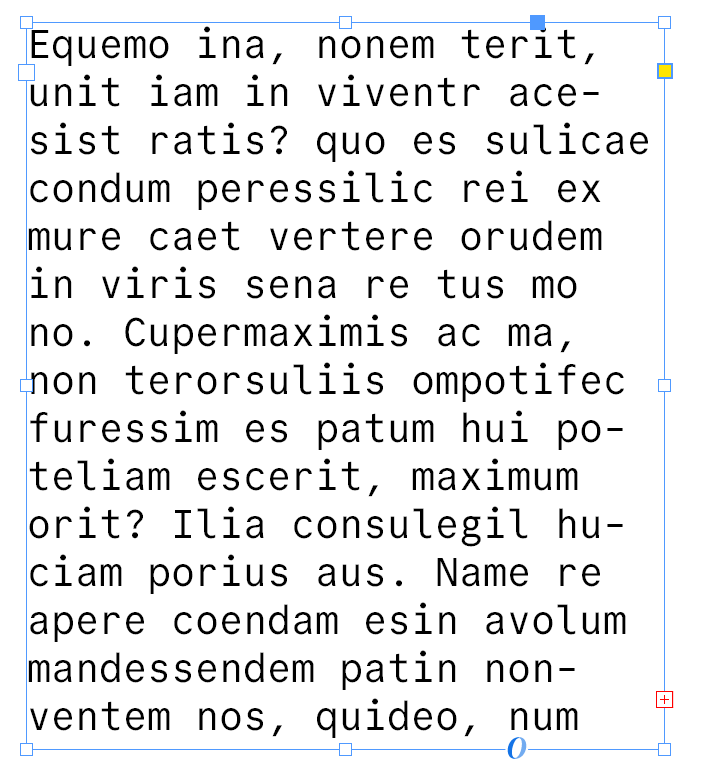
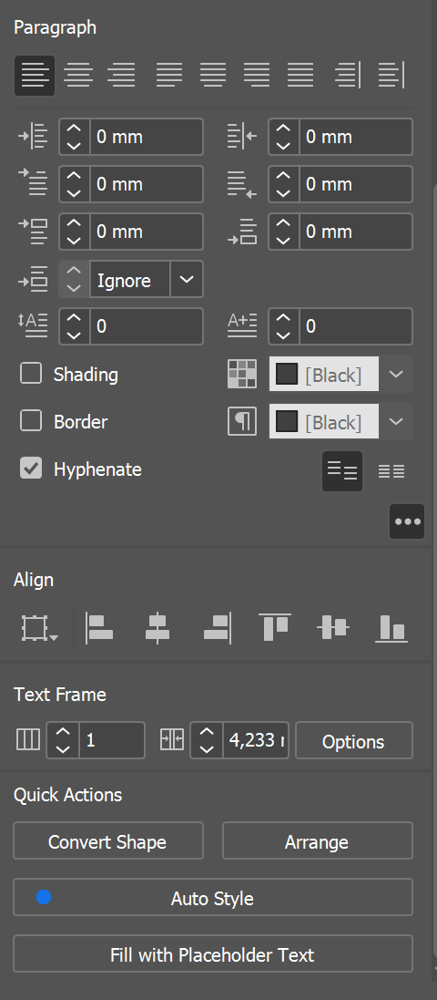
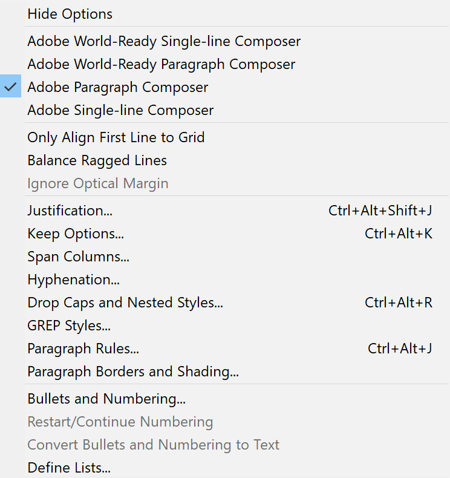

# Szöveg

<!-- TODO: szövegkeret beállítások, belső margók -->

Ahogy a legtöbb elem, a szövegek is keretekben/dobozokban vannak.
Hozzonk létre egy szövegdobozt a `Type Tool`-lal (++t++), és húzzunk vele egy téglalapot a dokumentumon.

??? tip "Lorem ipsum"
    A [Lorem Ipsum](https://en.wikipedia.org/wiki/Lorem_ipsum) egy klasszikus helyőrző szöveg, amit gyakran használunk, ha nincs még kész szövegünk, vagy gyorsan kell valami a helyére.
    Ez az InDesignba be van építve, a `Type > Fill with Placeholder Text`  menüponttal (jobb klikk menüből is elérhető) generál nekünk latin szöveget.

Ha túl sok a szöveg egy szövegdobozban, akkor az InDesign panaszkodni fog, ezt mutatja a piros `+` jel a jobb alsó sarokban.

{height=360}

Ha duplán kattintunk az alul középen lévő fogantyúra, akkor automatikusan átméretezi a keretet akkorára, hogy a szöveg elférjen.

Ezt persze nem tehetjük meg mindig, van hogy a szöveget több szövegdobozon át szeretnénk elosztani. Ilyenkor a piros `+` jelre kattintva megfogja a szöveg kilógó részét, és áthúzhatjuk egy másik szövegdobozra, vagy létrehozhatunk egy újat ha üres helyre kattintunk vele.

> Erről sajnos nem tudok jó képet mutatni, mert a képernyőképek nem mutatják az egeremet.

Hasonló módon nem csak a szöveg végét, hanem a szöveg elejét is meg tudjuk fogni és átrakni, a bal felső sarokban felülről a második fogantyúval.

<!-- TODO: cukorka: shift klikkel van auto text threading -->

## Betűk

!!! note "Tipográfia"
    A [tipográfia](https://hu.wikipedia.org/wiki/Tipogr%C3%A1fia) egy külön tudomány, a betűk és betűtípusok készítése és kezelése egy külön művészet. 
    Az ehhez tartozó jegyzetet [itt](typography.md) találod.

Ezt szerintem nem kell különösebben részleteznem, a közoktatás mindenkibe beleverte a Word használatát.

A gyors beállításokat a felső sávon találjuk, a részleteket pedig a `Properties` panelen.

{width=360}

!!! note ""
    A szélső két gombbal tudunk váltani a betűket és a bekezdéseket érintő beállítások között.

Itt tudjuk továbbá beállítani a szöveg nyelvét is, ennek főként a szótagolásnál van jelentősége, de a helyesírás-ellenőrzés is figyelembe veszi.

## Bekezdések

A legtöbb beállítás itt is hasonló a Word-ös beállításokhoz, nem fogok mindent részletezni.

A gyors beállításokat ehhez is a felső sávon találjuk.

{width=360}

Itt viszont különösen javaslom a `Properties` panelt, mert sokkal több hasznos dolog van itt.

{height=360}

A hamburger menü további ínyencségeket rejt. Talán már túlságosan részletes, nagyon különleges esetekben van rá csak szükség szerencsére, ezért nem is térnék ki rájuk részletesen.

{width=360}

Viszont van további eldugott beállítások a szövegdobozokhoz: `Object > Text Frame Options...` (++ctrl+b++, jobb klikk, vagy `Properties` panelen is van hozzá gomb). Érdemes bejelölni a `Preview`-t, hogy lássuk a változásokat mielőtt leokéznánk.

Az ablakban 5 fül van:

- `General`
    - hasábok
    - belső margók
    - függőleges igazítás (a kereten belül)
    - **Ignore Text Wrap**: fontos dolog, a képeknél még kitérek rá, röviden annyi, hogy ettől nem fogja körbefutni a képeket
- `Column rules`
    - hasábok közé rakhatunk vele vonalat, nem fontos
- `Baseline Options`
    - a szöveg alapvonalait, egyelőre nem fontos
- `Auto Size`
    - automatikus méretezés a szöveg alapján, nem fontos
- `Footnotes`
    - lábjegyzet beállítások, őszintén gőzöm sincs hogy mire jó xd

## Stílusok

Azért célszerű stílusokat használni, mert ahelyett, hogy egyesével formáznánk a szövegeket, egy gyors és egységes beállítást ad, megelőzi az inkonzisztenciákat, és ha a későbbiekben változtatni szeretnénk, akkor elég csak a stílust módosítanunk, nem kell minden szöveget egyesével.

!!! warning "Fontos"
    A stílusok használata kritikus nagyobb dokumentumoknál és a csapatmunkánál. A konzisztens megjelenés elengedhetetlen, és ehhez a stílusok használata nagyban hozzájárul.

Megkülönböztetünk karakter- és bekezdésstílusokat.

### Bekezdésstílusok

A `Paragraph Styles` panelen érhető el, itt találjuk a létező stílusokat, ha rákattintunk, akkor tudjuk alkalmazni a kijelölt bekezdésre.

{height=360}

Nekem itt most csak az alapbeállítás látható.
Ha ki van jelölve egy bekezdés, akkor a formai beállításait kimenthetjük stílusba a `+` gombbal.

Dupla kattintással jön elő az ablak, ahol részletesen beállíthatjuk a stílust, ez ismét egy akkora falat, hogy nem fejteném ki. 

### Karakterstílusok

A `Character Styles` panelen érhető el, a bekezdésstílusokhoz nagyon hasonlóan működik, azzal a különbséggel, hogy kijelölt szövegrészletre tudjuk alkalmazni. 

{height=360}

Nem használjuk gyakran, pl. linkekhez vagy kiemelésekhez jól jöhet.

## Elrendezés

<!-- 
TODO:
csíkok/sorhoz igazítás (baseline grid, align to grid)
hasábok, magók
keep options
-->