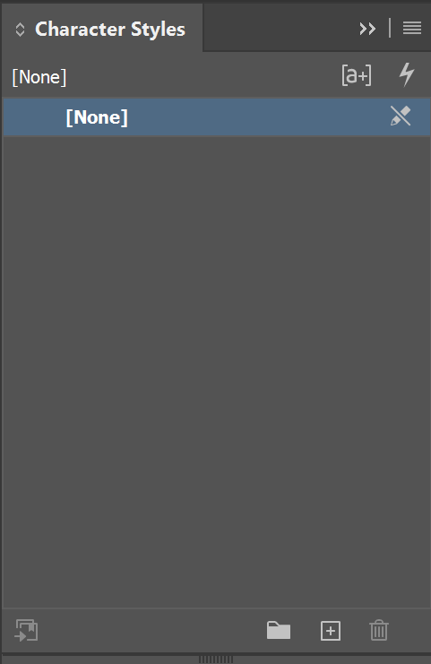

# Szöveg

<!-- TODO: szövegkeret beállítások, belső margók -->

Ahogy a legtöbb elem, a szövegek is keretekben/dobozokban vannak.
Hozzonk létre egy szövegdobozt a `Type Tool`-lal (++t++), és húzzunk vele egy téglalapot a dokumentumon.

??? tip "Lorem ipsum"
    A [Lorem Ipsum](https://en.wikipedia.org/wiki/Lorem_ipsum) egy klasszikus helyőrző szöveg, amit gyakran használunk, ha nincs még kész szövegünk, vagy gyorsan kell valami a helyére.
    Ez az InDesignba be van építve, a `Type > Fill with Placeholder Text`  menüponttal (jobb klikk menüből is elérhető) generál nekünk latin szöveget.

Ha túl sok a szöveg egy szövegdobozban, akkor az InDesign panaszkodni fog, ezt mutatja a piros `+` jel a jobb alsó sarokban.

{height=360}

Ha duplán kattintunk az alul középen lévő fogantyúra, akkor automatikusan átméretezi a keretet akkorára, hogy a szöveg elférjen.

Ezt persze nem tehetjük meg mindig, van hogy a szöveget több szövegdobozon át szeretnénk elosztani. Ilyenkor a piros `+` jelre kattintva megfogja a szöveg kilógó részét, és áthúzhatjuk egy másik szövegdobozra, vagy létrehozhatunk egy újat ha üres helyre kattintunk vele.

> Erről sajnos nem tudok jó képet mutatni, mert a képernyőképek nem mutatják az egeremet.

Hasonló módon nem csak a szöveg végét, hanem a szöveg elejét is meg tudjuk fogni és átrakni, a bal felső sarokban felülről a második fogantyúval.

<!-- TODO: cukorka: shift klikkel van auto text threading -->

## Betűk

!!! note "Tipográfia"
    A [tipográfia](https://hu.wikipedia.org/wiki/Tipogr%C3%A1fia) egy külön tudomány, a betűk és betűtípusok készítése és kezelése egy külön művészet. 
    Az ehhez tartozó jegyzetet [itt](typography.md) találod.

Ezt szeirintem nem kell különösebben részleteznem, a közoktatás mindenkibe beleverte a Word használatát.

A gyors beállításokat a felső sávon találjuk, a részleteket pedig a `Properties` panelen.

!!! note ""
    A szélső két gombbal tudunk váltani a betűket és a bekezdéseket érintő beállítások között.

Itt tudjuk továbbá beállítani a szöveg nyelvét is, ennek főként a szótagolásnál van jelentősége, de a helyesírás-ellenőrzés is figyelembe veszi.

## Bekezdések

<!-- TODO: paragraph styles -->

## Stílusok

TODO

### Karakterstílusok

A karakterstílusok segítéségével gyorsan és konzisztensen tudunk szöveget formázni. 

!!! warning "Nem bekezdésstílus"
    Nem összetévesztendő a bekezdésstílusokkal, amikről mindjárt szó lesz.
    A karakterstílusok a szöveg egyes karaktereinek formázására szolgálnak, míg a bekezdésstílusok az egész bekezdésre vonatkoznak.

Azért célszerű stílusokat használni, ahelyett hogy egyesével formáznánk a szövegeket, egy egységes beállítást ad, megelőzi az inkonzisztenciát, és ha a későbbiekben változtatni szeretnénk, akkor csak a stílust kell módosítanunk, nem kell egyesével. 

!!! warning ""
    A stílusok használata kritikus nagyobb dokumentumoknál, és a csapatmunkánál. A konzisztens megjelenés elengedhetetlen, és ehhez a stílusok használata nagyban hozzájárul.

Vegyük elő a `Character Styles` panelt.

<!-- TODO -->

## Elrendezés

<!-- 
TODO:
csíkok/sorhoz igazítás (baseline grid, align to grid)
hasábok, magók
text frame options
keep options
-->